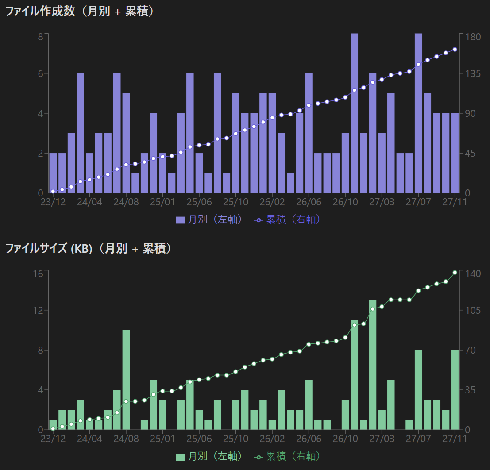

## サンプル画像



## Dev Tool

`Ctrl + Shift + I`

## Pluginのホットリロード

[Hot-Reload](https://github.com/pjeby/hot-reload) プラグインを利用

## Reactの利用

- `main.ts` は `main.tsx` にリネーム
- `esbuild.config.mjs` において `entryPoints: ["main.tsx"]` に変更
- `main.js` はRoot直下に出力する必要があるため注意

## テスト用Vaultの作成

[obsidian_dataview_example_vault](https://github.com/s-blu/obsidian_dataview_example_vault?tab=readme-ov-file) を利用

配下のファイル作成日時をランダムに変更

```powershell
Get-ChildItem -Path "." -Recurse -File | ForEach-Object {
    $randomDays = Get-Random -Minimum -730 -Maximum 730
    $randomDate = (Get-Date).AddDays($randomDays)
    Set-ItemProperty -Path $_.FullName -Name CreationTime -Value $randomDate
    Set-ItemProperty -Path $_.FullName -Name LastWriteTime -Value $randomDate
}

Get-ChildItem -Path "." -Recurse -File | Select-Object Name, CreationTime, LastWriteTime
```

